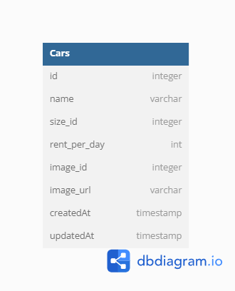

# Binar: Challenge 04 Car List Database 
Fullstack Web Development Challenge 4 Binar Academy - FSW2402KM6004 Andhika Rizky Aulia  
A fullstack web application using express.js and postgreSQL as the database. Have CRUD operation and use cloudinary as image storage platform

# How to Use
1. `git clone https://github.com/ndikrp/f-fsw24001086-km6-and-dsb-ch4.git`
2. `npm install` to install all the dependencies
3. Create a .env file and make it match the .env.example file in root directory
4. Go to src\routes\handler\cloudinary.js and configure your cloudinary credentials. Go to [Cloudinary](https://cloudinary.com) to register if you haven't have an account yet
5. Make sure [PostgreSQL](https://www.postgresql.org/download/) is installed and running on your computer
6. Go to src\db\config directory and configure config.json according to your database credentials
7. run create database script `npm run create-data` to create database in your PostgreSQL
8. run migrate script `npm run migrate-data` to migrate
9. (OPTIONAL) - run seed data script `npm run seed-data` to populate the database with dummy data
              - run undo seed script `npm run undo-seed` to undo the seeders
10. run `npm run start` to run the server
11. Done
-----------------------
# Page Available
| Page | Route | Default Route |
|--|--|--|
| Homepage | `/` | http://localhost:8000/ |
| Add Car | `/add` | http://localhost:8000/add |
| Edit Car | `/edit?id={carId}` | http://localhost:8000/edit?id={Id} |
-----------------------
# Endpoint Available
### Server Connection Test
To ensure connection to the server
#### *HTTP Request*
> **GET**   
> `/api/v1`

#### *Default Request URL*

    http://localhost:8000/api/v1

#### *Expected Response*
Response Code: `200`  
Response Type: `application/json`  
Response Body:  

    {
	    "status": "Succes!",
	    "message": "Server is running!"
    }
    
-----------------------
### Get All Cars

Return list of cars from the database.

#### *HTTP Request*
> **GET**   
> `/api/v1/cars`

#### *Default Request URL*

    http://localhost:8000/api/v1/cars

#### *Expected Response*
Response Code: `200`  
Response Type: `application/json`  
Response Body:  

    {
    	"status": "Success!",
    	"message": "Cars retrieved succesfully",
    	"data": [
    		{
    			"id": number,
    			"name": string,
    			"size": string,
    			"rent_per_day": number,
    			"image_id": string,
    			"image_url": string,
    			"createdAt": timestamp,
    			"updatedAt": timestamp
    		}
    	]
    }
-----------------------
### Get Car Data by Id

Return car data by id from the database.

#### *HTTP Request*
> **GET**   
> `/api/v1/cars/{id}`

#### *Default Request URL*

    http://localhost:8000/api/v1/cars/{id}

#### *Expected Response*
Response Code: `200`  
Response Type: `application/json`  
Response Body:  

    {
    	"status": "Success!",
    	"message": "Car with id {id} retrieved succesfully",
    	"data": [
    		{
    			"id": number,
    			"name": string,
    			"size": string,
    			"rent_per_day": number,
    			"image_id": string,
    			"image_url": string,
    			"createdAt": timestamp,
    			"updatedAt": timestamp
    		}
    	]
    }
    
-----------------------
### Add New Car

Insert new car into the database.

#### *HTTP Request*
> **POST**
> `/api/v1/cars`

#### *Default Request URL*

	http://localhost:8000/api/v1/cars

#### *Expected Request*
Request Type: `application/json`  
Request Body:   

    {
    	"name": string,
    	"size": string,
    	"rent_per_day": number,
    	"image_id": string,
    	"image_url": string,
    }

#### *Expected Response*
Response Code: `201`   
Response Type: `application/json`   
Response Body:  

    {
    	"status": "Success!",
    	"message": "Car created successfully"
    }

-----------------------
### Update Car by Id 

Edit Car data by Id.

#### *HTTP Request*
> **PUT**   
> `/api/v1/cars/{Id}`

#### *Default Request URL*

    http://localhost:8000/api/v1/cars/{Id}

#### *Expected Request*
Request Type: `application/json`   
Request Body:   

    {
    	"name": string,
    	"size": string,
    	"rentPerDay": number,
    	"editImg": boolean,
    }

#### *Expected Response*
Response Code: `200`    
Response Type: `application/json`   
Response Body:   

    {
    	"status": "Success!",
    	"message": "Car with id {id} updated succesfully"
    }
-----------------------
### Delete Car with ID

Delete Car data by Id from the database

#### *HTTP Request*
> **DELETE**   
> `/api/v1/cars/{Id}`

#### *Default Request URL*

    http://localhost:8000/api/v1/cars/{Id}

#### *Expected Response*
Response Code: `200`   
Response Type: `application/json`   
Response Body:   

    {
        "status": "Success!",
        "message": "Car with id {Id} deleted successfully"
    }

-----------------------
# Database Design

-----------------------
# Dependencies
* [express](https://www.npmjs.com/package/express) (API Framework)
* [nodemon](https://www.npmjs.com/package/nodemon) (For easy development)
* [morgan](https://www.npmjs.com/package/morgan) (For the middleware)
* [eslint](https://www.npmjs.com/package/eslint) (Just for indentation and linebreak style)
* [cors](https://www.npmjs.com/package/cors) (Just to make sure if there are any CORS header not allowed)
* [dotenv](https://www.npmjs.com/package/dotenv) (To load environtment variables from `.env`)
* [ejs](https://www.npmjs.com/package/ejs) (For EJS template system)
* [multer](https://www.npmjs.com/package/multer) (To handle `multipart/form-data`)
* [pg](https://www.npmjs.com/package/pg) (Non-blocking PostgreSQL client for Node.js)
* [sequelize](https://www.npmjs.com/package/sequelize) (ORM tool for PostgreSQL and other dbs)
* [cloudinary](https://www.npmjs.com/package/cloudinary) (optimize, transform, upload and manage file/image to cloudinary)
